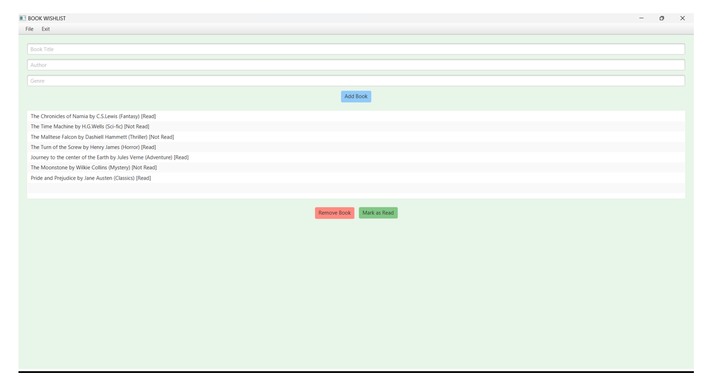

# Book Wishlist Application (JavaFX)

A desktop application built using JavaFX that allows users to manage a personal book wishlist.

## Features
- Add books with title, author, and genre
- Remove books
- Mark books as read
- Save wishlist to a text file

## Technologies Used
- Java 17
- JavaFX 17

## How to Run

Compile:
javac --module-path "PATH_TO_JAVAFX_LIB" --add-modules javafx.controls application\BookWishlist.java

Run:
java --module-path "PATH_TO_JAVAFX_LIB" --add-modules javafx.controls application.BookWishlist

> Note: UI appearance may vary slightly depending on JavaFX version and OS theme.
## Application Preview

